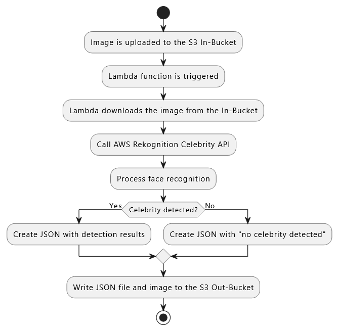

# Dokumentation

## Inhaltsverzeichnis
- [Dokumentation](#dokumentation)
  - [Inhaltsverzeichnis](#inhaltsverzeichnis)
  - [Einleitung](#einleitung)
    - [Ziel des Projekts](#ziel-des-projekts)
  - [Vorgehen](#vorgehen)
  - [Gruppenreflexion](#gruppenreflexion)
    - [Was ist uns gut gelungen?](#was-ist-uns-gut-gelungen)
    - [Was ist Ausbaufähig?](#was-ist-ausbaufähig)
    - [Was wir für die Zukunft mitnehmen?](#was-wir-für-die-zukunft-mitnehmen)
  - [Einzelreflexion](#einzelreflexion)
    - [David Provenzano](#david-provenzano)
    - [Aulon Gashi](#aulon-gashi)
    - [Yves Jaros](#yves-jaros)
  - [Visualisierung](#visualisierung)
    - [Flowchart - Hauptprozess](#flowchart---hauptprozess)
  - [Testfälle](#testfälle)
  - [Ausführung des Projektes](#ausführung-des-projektes)
    - [Was benötigt man?](#was-benötigt-man)
    - [Wie führt man es aus?](#wie-führt-man-es-aus)
  - [Quellen](#quellen)

## Einleitung
### Ziel des Projekts

## Vorgehen

## Gruppenreflexion
### Was ist uns gut gelungen?  

### Was ist Ausbaufähig?  

### Was wir für die Zukunft mitnehmen?  

## Einzelreflexion
### David Provenzano

- Was ist mir gut gelungen?  

- Was ist ausbaufähig?  

- Was nehme ich für die Zukunft mit?  

### Aulon Gashi

- Was ist mir gut gelungen?  

- Was ist ausbaufähig?  

- Was nehme ich für die Zukunft mit?  

### Yves Jaros

- Was ist mir gut gelungen?  

- Was ist ausbaufähig?  

- Was nehme ich für die Zukunft mit?  

## Visualisierung

### Flowchart - Hauptprozess

## Testfälle 

## Ausführung des Projektes
### Was benötigt man?

### Wie führt man es aus?

## Quellen
- Conventional Commits, 04.12.2025, https://www.conventionalcommits.org/en/v1.0.0/
- PlantUML, 10.12.2025, https://plantuml.com/en/